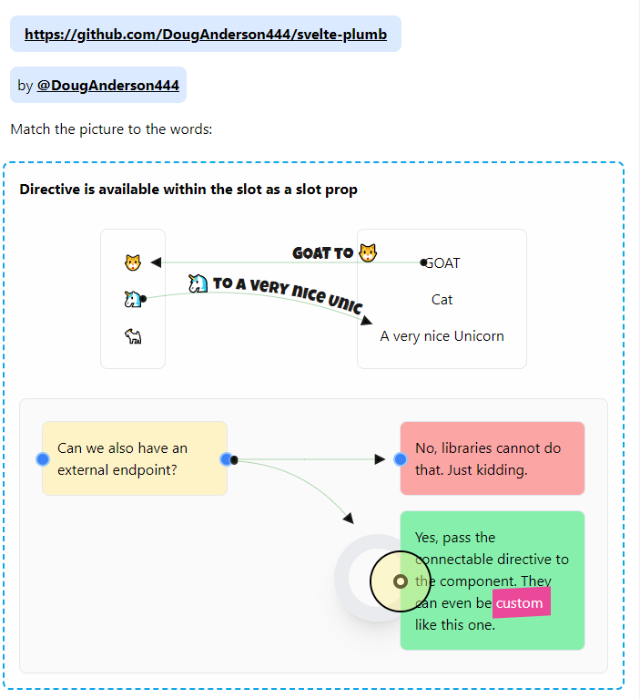
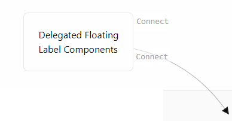

# Svelte Plumb

Connect HTML Elements with SVG paths. Aiming for a simple API.

- [x] Simple API
- [x] Defaults + Customization
- [x] Connect Elements and EndPoints
- [x] Touch/Mobile friendly
- [x] Restrictive options for connectables (start only, drop only)
- [x] Delegate connectable to a label, which follows the path arrow after connect



## The Problem

Most javascript diagram libraries use SVGs for non-line / connectors. This is silly, we have HTML for that. This library explores making js diagramming a bit more simple to program and use as a library.

Also, frameworks like js-plumb are a bit complex to use, the setup is a bit much so this is an attempt to simplify it using Svelte's API.

## Solution: One Parent Component + One Action directive

The bare minimum is a framework Component wrapper (in this case, Svelte) because:

1. SVG lines need to be drawn relative to common, fixed coords (ie. the Parent)
2. We need a Parent component to be able to use helper components (like the "Connecting..." HTML div, which is also written in Svelte). Without a Parent component (for instance, if you chose to [use action directives](https://svelte.dev/docs#template-syntax-element-directives-use-action) exclusively), you wouldn't be able to use Svelte's slick API, and life would be hard.
3. In order to have `position: absolute` SVGs, we need a Parent to be `positioned: relative`. Need a parent component for this too... if it didn't exist, well, you'd have to make an HTML version of it. So why not use the component framework and kee life simply and easy.

QED, as my high school math teacher would say.

## API

HTML elements need an `id`, if they don't have one, a random one will be generated for them. This is used to connect the elements using `element.getElementById()`.

### Basic Use

```svelte
import {Canvas} from '@douganderson444/svelte-plumb';

<Canvas bind:data let:connectable>
	<div use:connectable>This HTMLElement is now connectable for drag and drop</div>
</Canvas>;
```

<hr>

### Use with optional EndPoints

```svelte
import {(Canvas, EndPoint)} from '@douganderson444/svelte-plumb';

<Canvas bind:data let:connectable>
	<div use:connectable={options}>This HTMLElement is now connectable for drag and drop</div>

	<!-- OPTION: use end points, absolutely positioned against a relative positioned parent  -->
	<div class="relative" style="position: relative">
		We also add endpoints outside the element.
		<EndPoint position={'right'} {connectable} />
		<EndPoint position={'left'} {connectable} />
	</div>
</Canvas>
```

<hr>

### Use with optional styling

```svelte
import {(Canvas, EndPoint)} from '@douganderson444/svelte-plumb';

<Canvas bind:data let:connectable on:connected={handleConnected}>
	<div use:connectable>This HTMLElement is now connectable for drag and drop</div>

	<!-- OPTIONS -->
	<!-- Styles are Tailwindcss shortcuts, but regular css works too -->

	<!-- OPTION, style your endpoint -->
	<div class="relative" style="position: relative">
		I like my endpoints like I like my donuts.
		<EndPoint position={'left'} {connectable} {options}>
			<div
				class="h-4 w-4 bg-white rounded-full border-4 border-black hover:ring hover:ring-green-800"
			/>
		</EndPoint>
	</div>

	<!-- OPTION, override connecting marker, with slot="marker" -->
	<div
		slot="marker"
		class="h-16 w-16 p-8 rounded-full bg-pink-500 shadow-xl opacity-50 select-none border-[2em]"
	/>
</Canvas>
```

So, anything within the Canvas component with a `use:connectable` action directive will be connectable. The SVG lines will be drawn relative to the Canvas component, and away you go. Everything else is done behind the scenes by Svelte.

### Use with optional data

You can also pass data to the `on:connected` event by setting options on the `use:connected={option}` directive.

```svelte
<script>
import { Canvas } from '@douganderson444/svelte-plumb';

function handleConnected(e) {
	console.log(e.detail.source?.dataset?.point + ' to ' + e.detail.target?.dataset?.point); // A to B
}
</script>

<Canvas bind:data let:connectable on:connected={e=>console.log()}>
	<div use:connectable{{ dataset: { point: 'A' }, restrictions: { startOnly: true } }}>Point A</div>
	<div use:connectable{{ dataset: { point: 'B' }, restrictions: { dropOnly: true } }}>Point B</div>
</Canvas>;

```

### Use with Optional Delegated Connect Component



You can make a component connectable by wrapping it in the `Delegate` component. This is useful if you want to make a label connectable, but don't want to make the whole component connectable.

First, make the component by wrapping it in the `Delegate` componentwith the `mounted` prop and the `on:ready` event listener, which is used internally by the `svelte-plumb` action directive.

```svelte
<!-- Set accessors true -->
<svelte:options accessors={true} />

<script>
	import { Delegate } from '@douganderson444/svelte-plumb';
	export let mounted;
	export let as; // angleStart, if you want the position of the component to adjust above or below the component
</script>

<!-- Wrap in Delegate Component, with mounted prop and on:ready listener -->
<Delegate {mounted} {as} on:ready>Connect Me</Delegate>
```

Once your custom delegated component is wrapped, you can use it in the `use:connectable` directive.

```svelte
<!-- ./App.svelte -->
<script>
	import DemoDelegated from './DemoDelegated.svelte';
</script>

<div use:connectable={{ startPoint: DemoDelegated }}>Has a connect component</div>
```

### All Options

Configure your connectable further with the following options:

```js
options = {
	dataset: {
		// object you want added to <HTMLElement data-attribute-* >
		color: 'blue', // adds data-color="blue"
		yourObject: 'any'
	},
	restrictions: {
		// restriction put on source and target abilities and quantities
		// defaults are false for all
		dropOnly: false, // set true if drop zone only, can't start a connection from here
		startOnly: false // set true if start zone only, can't drop a connection to here
	}
};
```

# Events

When a connection is made, an event is fired which passes along details of the connectable node:

```svelte
<Canvas bind:data let:connectable={options} on:connected={handleConnected}>

function handleConnected(e){
	console.log("Source's color", e.detail.source.dataset.color) // color set in source connectable's options.dataset.color
	console.log("Target's color", e.detail.target.dataset.color) // color set in target  connectable's options.dataset.color
}

```

# REPO Demo

`npm run dev`

# REPL Demo

https://svelte.dev/repl/cf05fb3c64674978a717ce1f861a82c0?version=3.49.0

# TODO

- [ ] CRUD link paths & text
- [ ] Move end points
- [ ] Add option: number of connectiosn allowed
- [ ] Disable duplicate links
- [ ] Better label API

# Inspiration

[https://demo.jsplumbtoolkit.com/flowchart-builder/](https://demo.jsplumbtoolkit.com/flowchart-builder/)

[https://github.com/bpmn-io/diagram-js](https://github.com/bpmn-io/diagram-js)

CSS by [https://tailwindcss.com/](https://tailwindcss.com/)

[Natto](https://natto.dev/)
